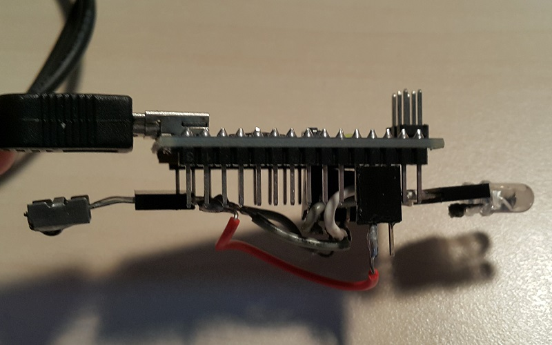

# pronto-remote

A sketch for an Arduino Nano (or similar) device to receive and transmit infrared codes in the Pronto Hex format. Able to record and transmit remote control commands from a wide range of devices.

## Device


## Getting Started

The project sketch has no 3rd-party dependencies, and may be used to program an Arduino device in the usual method using the Arduino IDE.

For infrared communication, an IR receiver module and an IR LED must be connected to the a programmed Arduino device. The circuit used in development used two 5mm IR LEDs in series and an active-low, 37.9kHz carrier frequency IR receiver module. The circuit was connected as follows:  

| Arduino Pin Number | Pin Label | IR LEDs | IR Receiver |  
| --- | --- | --- | --- |  
| 2 | D2 | - | Signal |  
| 3 | D3 | Positive | - |  
| - | GND | Negative | Negative |  
| - | +5V | - | Vdd |  

The corresponding pin numbers are `#define`d at the top of the project sketch and may be altered as required.

### Running

An Arduino device programmed with this project sketch waits for serial communication (at Baud rate 115200). Input is expected to be in one of the following forms.

* `R` - Record Pronto from IR receiver\*.
* `S` - Send currently stored Pronto code.
* `I` - Print currently stored Pronto Hex code over serial.
* `[Pronto Hex String]` - Store the Pronto code given as a string of hexadecimal numbers\*.

\* These commands overwrite the currently stored Pronto code.

After submitting the record command, any further serial input cancels the recording (avoids infinite wait).

#### Pronto Hex Strings

Pronto Hex is a verbose, but flexible format to represent the code transmitted for an infrared command. Below is the Pronto Hex code for the `Power On` command for a Panasonic HDTV.
```
0000 0071 0000 0032 0080 003f 0010 0010 0010 0030 0010 0010 0010 0010 0010 0010 0010 0010 0010 0010 0010 0010 0010 0010 0010 0010 0010 0010 0010 0010 0010 0010 0010 0030 0010 0010 0010 0010 0010 0010 0010 0010 0010 0010 0010 0010 0010 0010 0010 0010 0010 0010 0010 0030 0010 0010 0010 0010 0010 0010 0010 0010 0010 0010 0010 0010 0010 0010 0010 0010 0010 0010 0010 0030 0010 0030 0010 0030 0010 0030 0010 0030 0010 0010 0010 0010 0010 0010 0010 0030 0010 0030 0010 0030 0010 0030 0010 0030 0010 0010 0010 0030 0010 0a98
```

This, and many other codes for electronic devices may be found at <http://www.remotecentral.com>. A code of this form may be sent to the Arduino device for immediate transmission.

For a full explanation of the Pronto Hex format, please visit [this guide](http://www.remotecentral.com/features/irdisp2.htm) on Remote Central.

### Tested Devices

The Arduino circuit described above was able to record and transmit commands from the remote for each of the following devices.

* Apple TV
* Panasonic TV
* Sony BluRay Player
* Sky Digital Set-top Box

## Authors

* **Marc Katzef** - [mkatzef](https://github.com/mkatzef)

## Acknowledgements

This project relied on <http://www.remotecentral.com>, for a great explanation of the Pronto Hex format, and a large library of existing codes.